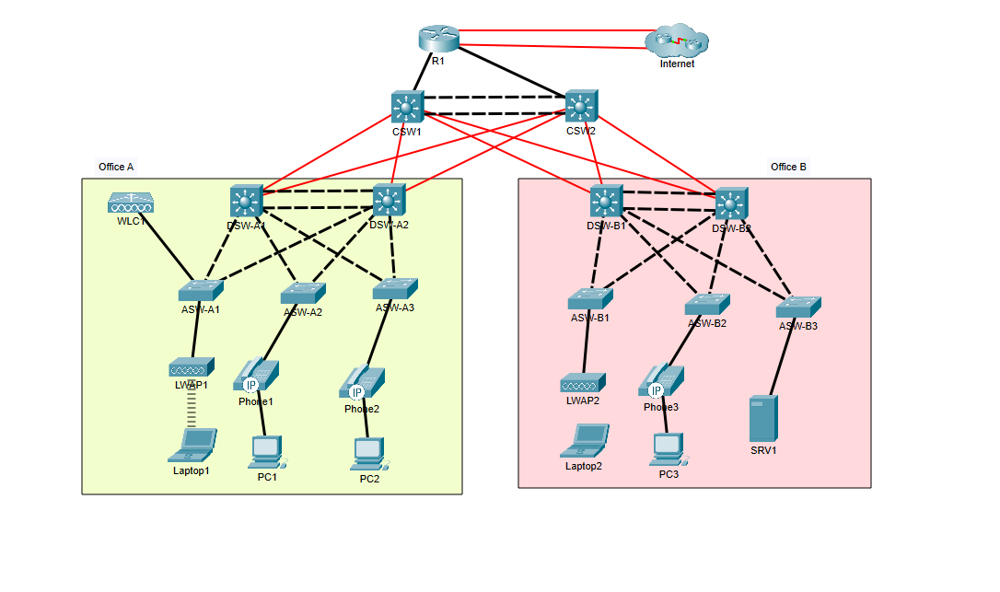

# Three-Tier Enterprise Campus Network

A complete two-office enterprise network built and configured in Cisco Packet Tracer. The lab covers every configuration topic on the CCNA 200-301 exam in one integrated topology: routing, switching, first hop redundancy, NAT, DHCP, IPv6, device hardening, and Layer 2 security.

> Lab design and grading file by [Jeremy's IT Lab](https://www.youtube.com/@JeremysITLab). All device configurations in this repository were completed by me.



## Topology Overview

The network is a three-tier design (core, distribution, access) with two branch offices joined through a redundant core, and a single edge router providing dual-homed Internet access.

| Layer | Devices | Role |
|---|---|---|
| Edge | R1 (ISR 2911) | Internet gateway, NAT, DHCP server, NTP master |
| Core | CSW1, CSW2 | Layer 3 core, OSPF backbone, Layer 3 EtherChannel between cores |
| Distribution (Office A) | DSW-A1, DSW-A2 | Inter-VLAN routing, HSRP gateways, STP root bridges |
| Distribution (Office B) | DSW-B1, DSW-B2 | Inter-VLAN routing, HSRP gateways, STP root bridges |
| Access (Office A) | ASW-A1, ASW-A2, ASW-A3 | End-user ports, WLC and AP, IP phones |
| Access (Office B) | ASW-B1, ASW-B2, ASW-B3 | End-user ports, AP, IP phones, server |
| Simulated ISPs | ISP A, ISP B | Upstream providers (preconfigured, included for reference) |

## Addressing and VLANs

| VLAN | Purpose | Office A Subnet | Office B Subnet | HSRP Virtual IP |
|---|---|---|---|---|
| 10 | PCs | 10.1.0.0/24 | 10.3.0.0/24 | .1 |
| 20 | Voice (IP phones) | 10.2.0.0/24 | 10.4.0.0/24 | .1 |
| 30 | Servers | n/a | 10.5.0.0/24 | .1 |
| 40 | Wi-Fi clients | 10.6.0.0/24 | n/a | .1 |
| 99 | Management | 10.0.0.0/28 | 10.0.0.16/28 | 10.0.0.1 / 10.0.0.17 |
| 1000 | Unused native VLAN on trunks | n/a | n/a | n/a |

Point-to-point links between R1, the core, and distribution use /30 subnets from 10.0.0.32/27. Each Layer 3 device has a /32 Loopback0 (10.0.0.76 through 10.0.0.82) used as its OSPF router ID.

Key hosts:
* **SRV1** (10.5.0.4): DNS and syslog server, published to the Internet via static NAT as 203.0.113.113
* **WLC1** (10.0.0.7): Wireless LAN controller, advertised to APs through DHCP option 43

## What's Configured

### Routing
* **OSPF single area 0** across R1, both core switches, and all four distribution switches, using point-to-point network types on every routed link and loopbacks as router IDs
* **Default route redistribution**: R1 injects the default route into OSPF with `default-information originate`
* **Floating static default route**: primary default via ISP A, backup via ISP B with administrative distance 2
* **IPv6**: global unicast addressing on R1 and core uplinks (EUI-64 on the inside, static toward the ISPs) with primary and floating IPv6 default routes

### Switching and Redundancy
* **EtherChannel** using three methods:
  * Layer 3 PAgP port channel between CSW1 and CSW2
  * Layer 2 PAgP trunk port channel between DSW-A1 and DSW-A2
  * Layer 2 LACP trunk port channel between DSW-B1 and DSW-B2
* **Rapid PVST+** with deliberate root bridge placement: DSW-x1 is root for VLANs 10 and 99, DSW-x2 is root for the voice and wireless or server VLANs, with each switch acting as secondary for the other set
* **HSRPv2** with priority and preempt, matched to the STP root on each VLAN so the active gateway and the root bridge are always the same switch, spreading load across both distribution switches
* **Trunking** with explicit allowed VLAN lists, an unused native VLAN (1000), and DTP disabled on access ports

### IP Services
* **DHCP**: R1 serves seven pools (management, PC, voice, and wireless per office) with excluded ranges, default gateways, DNS, and domain name; distribution SVIs relay requests with `ip helper-address`
* **NAT/PAT**: dynamic PAT for all user VLANs to a public pool (203.0.113.200/29), plus static NAT for SRV1
* **DNS**: all devices resolve names through SRV1
* **NTP**: R1 syncs from the ISP and serves as an authenticated NTP master (stratum 5) for the internal network
* **Syslog**: all network devices send logs to SRV1
* **SNMP**: read-only community configured on network devices
* **Wireless**: WLC with lightweight APs in both offices, discovered via DHCP option 43

### Security
* **SSH version 2 only** on all VTY lines, local user authentication, and a standard ACL restricting management access to the Office A PC subnet
* **Extended ACL** (`OfficeA_to_OfficeB`) on the Office A PC gateways that permits ping but blocks all other traffic from Office A PCs to Office B PCs
* **Port security** with sticky MAC learning, a two-address maximum on phone ports, and restrict violation mode
* **DHCP snooping** with trusted uplinks and rate limiting on access ports
* **Dynamic ARP Inspection** validating source MAC, destination MAC, and IP
* **PortFast and BPDU Guard** on all edge ports
* **CDP disabled, LLDP enabled**, with LLDP transmit turned off on end-user ports
* **Console timeouts and synchronous logging** on all lines

## Repository Structure

```
ccna-mega-lab/
├── README.md
├── Network_Diagram.png
└── Config_files/
    ├── R1_running-config.txt
    ├── CSW1_running-config.txt
    ├── CSW2_running-config.txt
    ├── DSW-A1_running-config.txt
    ├── DSW-A2_running-config.txt
    ├── DSW-B1_running-config.txt
    ├── DSW-B2_running-config.txt
    ├── ASW-A1_running-config.txt
    ├── ASW-A2_running-config.txt
    ├── ASW-A3_running-config.txt
    ├── ASW-B1_running-config.txt
    ├── ASW-B2_running-config.txt
    ├── ASW-B3_running-config.txt
    ├── ISP A_running-config.txt
    └── ISP B_running-config.txt
```

## Verification Commands

Useful commands for checking the lab state on each device:

```
show ip ospf neighbor
show ip route
show standby brief
show spanning-tree root
show etherchannel summary
show ip nat translations
show ip dhcp binding
show ip dhcp snooping binding
show port-security interface fa0/1
show ntp status
```

## Notes

* Built in Cisco Packet Tracer, so some commands (and some `show` output) differ slightly from physical IOS.
* Credentials, password hashes, and keys have been replaced with placeholders. This is a lab environment and no production values are included.
* The ISP routers were preconfigured as part of the lab and are included only so the full topology is documented.

## Skills Demonstrated

Enterprise network design, OSPF, first hop redundancy (HSRP), spanning tree tuning, EtherChannel (PAgP and LACP), inter-VLAN routing, DHCP and relay, NAT/PAT, IPv6, ACLs, SSH hardening, and Layer 2 security (port security, DHCP snooping, DAI, BPDU Guard).
